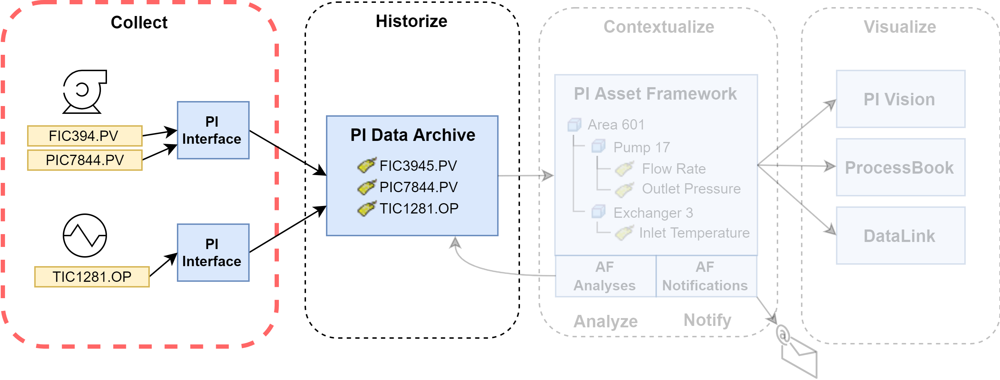

---

## PI Asset Framework Training
#### @css[green-emphasis](Koch Ag & Energy Solutions)
#### @css[green-emphasis](Dodge City and Fort Dodge)

Note: 

I see you!

---

### Course Overview

---
@snap[north]
### Objectivea
@snapend

By the end of this training session, you should:
@ul[text-09 list](false)
- Have a general knowledge of the PI System
- Be comfortable modifying asset hiearchies and analyses in PI Asset Framework
- Understand best practices for managing the PI System in production
@ulend

---
@snap[north-west]
### What We'll Cover
@snapend

@snap[west span-50]
@ul[text-07 list](false)
- PI System Overview
- Installing Client Tools
- PI Asset Framework Overview
- Attributes and Their Data References
- Configuring AF Attributes
@ulend
@snapend

@snap[east span-50]
@ul[text-07 list](false)
- Units of Measure in PI
- Asset Framework Analytics
- Templates in Asset Framework
- Element References
- PI AF Best Practices
@ulend
@snapend

---

### How to Use This Course

---

### PI System Overview

+++

### What is the PI System?
 
The PI System is a @css[green-emphasis](data infrastructure). It
<!--    -->
@ul[text-09 list](false)
- <b>collects</b> data,
- <b>historizes</b> data,
- <b>contextualizes</b> data,
- <b>analyzes</b> data,
- and <b>visualizes</b> data
@ulend
<!--    -->
<!--   -->
in meaningful ways in order to support decision making.

+++

@snap[north-west]
### PI Data Archive
Historizes data in one single source of truth.
@snapend

@snap[south span-100]

@snapend

+++

@snap[north-west]
### PI Data Archive
@ul
- Organized around the concept of PI Tags.
- Each PI Tag represents a single datastream
- Each datastream typically reflects a sensor in the field
@ulend
@snapend

+++

@snap[north-west]
### PI Interfaces
Collects data and sends it to the Data Archive
@snapend

@snap[south span-100]

@snapend

+++

@snap[north-west]
### PI Asset Framework
Contextualizes PI Tags by organizing them in a hierarchy.
@snapend

@snap[south span-100]

@snapend

---

###Client Tools

---

### Installing Client Tools

+++

### Client Tools for the PI System

@ul[text-09 list](false)
- PI System Management Tools (SMT)
- PI System Explorer (SE)
- Microsoft Excel (through Add-ins)
    - PI Builder
    - DataLink
@ulend

+++
@snap[north-west]
### PI System Management Tools (SMT)
@snapend

@snap[west]
@ul[text-09 list](false)
- Data Archive management
- Tag building and configuration
- "Lower-level" security
- Interface management
- General IT stuff
@ulend
@snapend

@snap[east]

@snapend

---

### A Worked Example

TODO: Add some things

--- 

### PI Asset Framework Overview

---

